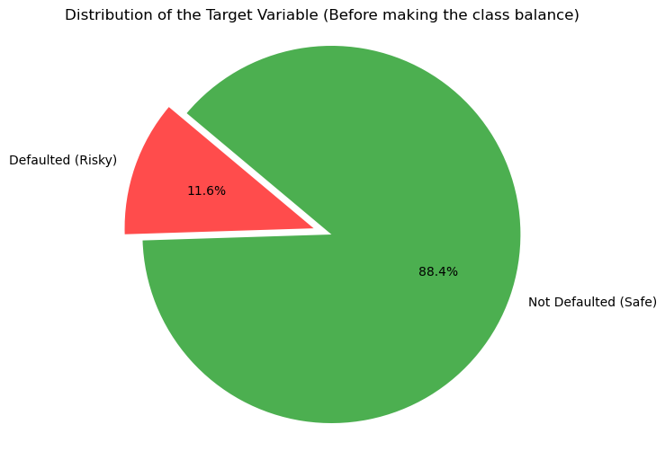
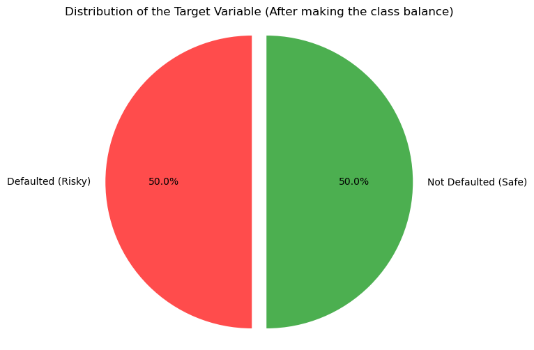
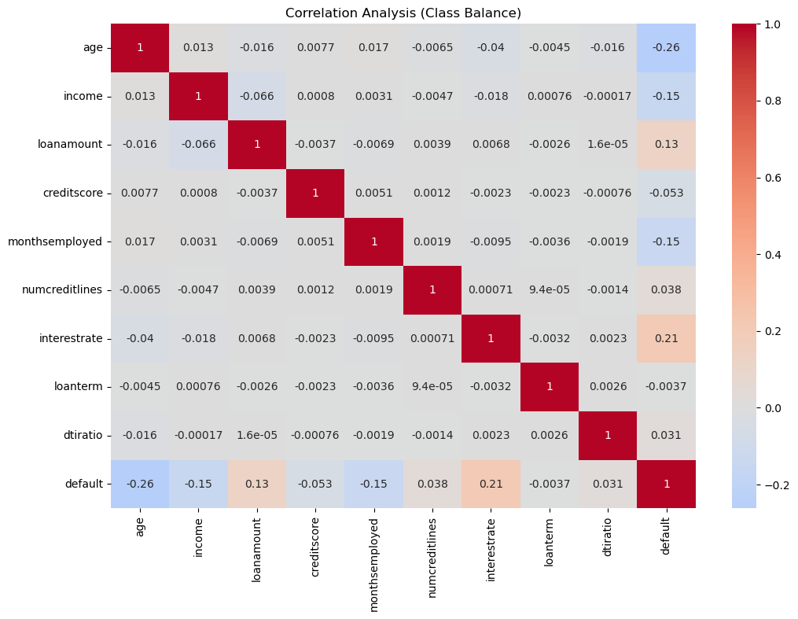
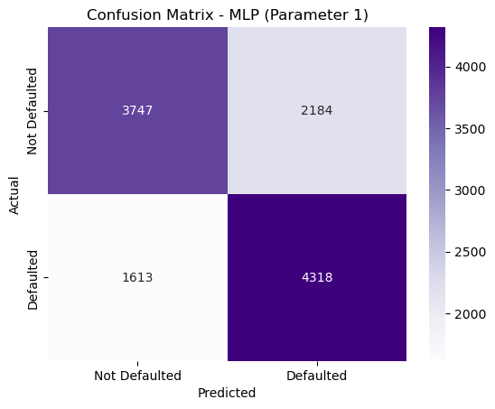
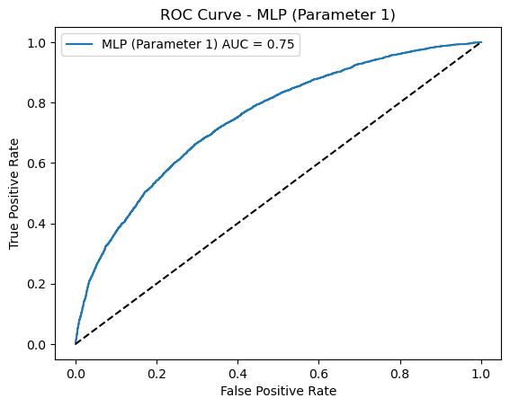

# Loan Default Prediction using Machine Learning

## Overview

Loan defaults pose a significant financial risk to lending institutions. Identifying high-risk borrowers before loan approval helps reduce losses, improve portfolio quality, and support data-driven lending decisions.

This project develops and compares multiple Machine Learning models to predict loan default risk using borrower information. The project follows an end-to-end Data Science workflow, including exploratory data analysis, data preprocessing, model development, hyperparameter tuning, and performance evaluation.

---

## Business Problem

Financial institutions need reliable methods to identify borrowers who are likely to default on loans.

The objective of this project is to:

- Predict loan default risk
- Improve credit approval decisions
- Reduce financial losses
- Support risk-based lending strategies

### Business Objective

The primary goal is to maximize **Recall** because failing to identify a potential defaulter (False Negative) is more costly than incorrectly flagging a safe borrower (False Positive).

---

## Dataset

### Source

Kaggle Loan Default Dataset

[https://www.kaggle.com/datasets/nikhil1e9/loan-default/data](https://www.kaggle.com/datasets/nikhil1e9/loan-default/data)

### Dataset Summary

| Attribute | Value |
|-----------|-------|
| Records | 255,347 |
| Features | 18 |
| Target Variable | Loan Default Status |
| Source | Kaggle |

---

## Dataset Challenges

The target variable exhibited class imbalance, where one class significantly outnumbered the other.

Since the project objective was to identify potential loan defaulters, training directly on the imbalanced dataset could bias models toward the majority class and reduce the ability to detect default cases.

To address this issue, an **Undersampling** technique was applied to balance the classes before model training. This helped improve the model's ability to identify defaulters and aligned the modeling process with the business objective of maximizing Recall.

---

## Tech Stack

### Programming Language

- Python
- Jupyter Notebook

### Data Analysis & Visualization

- Pandas
- NumPy
- Matplotlib
- Seaborn

### Machine Learning

- Scikit-Learn
- XGBoost
- LightGBM

### Model Evaluation Metrics

- Accuracy
- Precision
- Recall

---

## Project Workflow

```
Data Collection
      ↓
Data Cleaning
      ↓
Exploratory Data Analysis
      ↓
Class Imbalance Handling
      ↓
Feature Engineering (Normalization)
      ↓
Train-Test Split
      ↓
Model Training
      ↓
Hyperparameter Tuning
      ↓
Model Evaluation
      ↓
Model Comparison
```

---

## Exploratory Data Analysis

The dataset was analyzed to understand feature distributions, relationships, and target class behavior before model development.

Key analyses included:

- Missing value inspection
- Class distribution analysis
- Correlation analysis
- Numerical and categorical feature exploration
- Default versus non-default borrower comparison
- Assessment of class imbalance and its impact on model performance

### Key EDA Insights

- The target variable exhibited class imbalance, making Recall a critical evaluation metric.
- Undersampling was performed to create a balanced training dataset.
- Correlation analysis revealed relationships among borrower attributes and loan default behavior.
- Feature distributions highlighted differences between default and non-default borrowers.

### Class Distribution Before Undersampling



### Class Distribution After Undersampling



### Correlation Heatmap



---

## Machine Learning Models

The following models were trained and evaluated:

1. Logistic Regression
2. Decision Tree
3. Random Forest
4. Gradient Boosting
5. XGBoost
6. LightGBM
7. Multi-Layer Perceptron (MLP)

---

## Model Performance Comparison

### Baseline Models

| Model | Train Accuracy | Test Accuracy | Train Precision | Test Precision | Train Recall | Test Recall |
|-------|---------------|--------------|----------------|---------------|-------------|------------|
| Logistic Regression | 68% | 68% | 68% | 68% | 69% | 69% |
| Decision Tree | 100% | 58% | 100% | 58% | 100% | 59% |
| Random Forest | 100% | 68% | 100% | 68% | 100% | 67% |
| Gradient Boosting | 69% | 68% | 69% | 68% | 69% | 69% |
| XGBoost | 79% | 67% | 79% | 67% | 79% | 67% |
| LightGBM | 72% | 68% | 72% | 68% | 72% | 68% |
| MLP | 72% | 67% | 72% | 67% | 72% | 67% |

### Fine-Tuned Models

| Model | Train Accuracy | Test Accuracy | Train Precision | Test Precision | Train Recall | Test Recall |
|-------|---------------|--------------|----------------|---------------|-------------|------------|
| Logistic Regression | 68% | 68% | 69% | 67% | 65% | 63% |
| Decision Tree | 68% | 68% | 69% | 67% | 65% | 63% |
| Random Forest | 75% | 68% | 75% | 68% | 75% | 68% |
| Gradient Boosting | 71% | 69% | 71% | 69% | 71% | 69% |
| XGBoost | 71% | 68% | 72% | 69% | 71% | 68% |
| LightGBM | 70% | 69% | 70% | 69% | 70% | 69% |
| MLP | 69% | 68% | 67% | 66% | 73% | 73% |

---

## Best Model Analysis

### Highest Accuracy
- Gradient Boosting (69%)
- LightGBM (69%)

### Highest Precision
- Gradient Boosting (69%)
- XGBoost (69%)
- LightGBM (69%)

### Highest Recall
- **MLP Neural Network (73%)**

---

## Recommended Model

### MLP Neural Network

Although Gradient Boosting and LightGBM achieved the highest overall accuracy (69%), the MLP achieved the highest recall (73%).

Since the business objective prioritizes identifying as many potential defaulters as possible, MLP provides the strongest practical value by minimizing false negatives.

### Confusion Matrix (MLP)



### ROC Curve (MLP)



---

## Key Findings

- Decision Tree exhibited severe overfitting.
- Ensemble methods significantly improved generalization performance.
- Gradient Boosting and LightGBM achieved the strongest overall accuracy.
- MLP achieved the highest recall and best aligned with business requirements.
- Recall proved more important than accuracy for loan default prediction.

---

## Business Impact

The final model can help financial institutions:

- Identify high-risk borrowers before approval
- Reduce loan default losses
- Improve credit risk assessment
- Support data-driven underwriting decisions
- Enhance portfolio quality and profitability

---

## Repository Structure

```
Loan-Default-Prediction/
│
├── Loan Default Prediction Project.ipynb
├── loan_default.csv
├── README.md
└── images/
    ├── class_dist_before.png
    ├── class_dist_after.png
    ├── correlation_heatmap.png
    ├── confusion_matrix_mlp.png
    └── roc_curve_mlp.png
```

---

## Future Improvements

- Implement SHAP explainability
- Deploy using Streamlit
- Build a real-time prediction API

---

## Author

**Reemika Subrata Das**
[](https://www.linkedin.com/in/reemikadas)

Interested in:
- Data Science
- Machine Learning Engineering
- Data Analytics
- Applied AI
